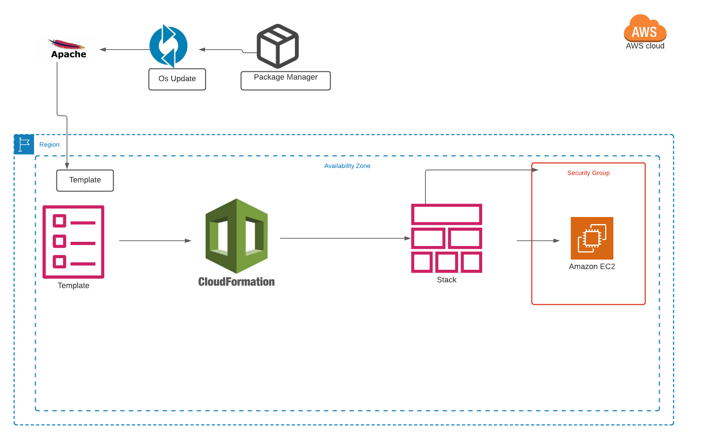
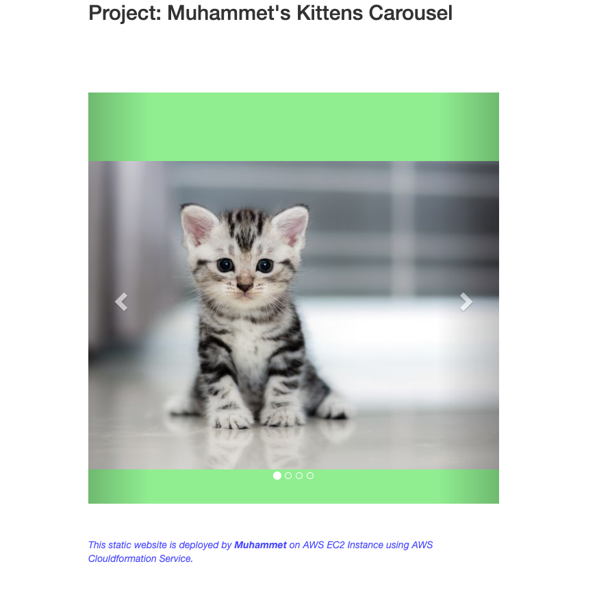

# Project-101 : Kittens Carousel Static Website deployed on AWS EC2 using Cloudformation

## Description
Kittens Carousel is a static website application deployed with Apache Web Server on AWS Elastic Compute Cloud (EC2) Instance using AWS Cloudformation Service. 




## Project Skeleton 

```
101-kittens-carousel-static-website-ec2 (folder)
|
|----readme.md         # Given to the students (Definition of the project)          
|----cfn-template.yml  # To be delivered by students (Cloudformation template)
|----static-web
        |----index.html  # HTML file
        |----cat0.jpg    # image file
        |----cat1.jpg    # image file
        |----cat2.jpg    # image file
```
## Expected Outcome

